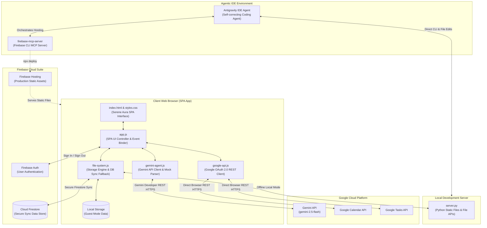

# System Architecture: Vanessa's Concierge

This document describes the architectural layout, module organization, data flow, and external integrations of **Vanessa's Concierge**.

---

## 1. System Architecture Diagram

The diagram below illustrates the relationship between the client-side SPA, the local development environment, the Google Cloud Services, the Firebase Cloud Suite, and the Agentic IDE developer workspace.

---

## 2. Module & Code Organization

The workspace is organized as a clean, modular Single Page Application (SPA) without the overhead of modern build tools, enabling instant loading and local server development.

### A. Frontend Layer (UI & Presentation)
* **[index.html](file:///c:/_working/Vanessas_Apps/Concierge/index.html):** The single page shell. Declares the navigation sidebar, responsive dashboard widgets, modal dialogs (Expense logger, Compiled Billing Report summaries), and the bottom-docked floating AI prompt bar.
* **[styles.css](file:///c:/_working/Vanessas_Apps/Concierge/styles.css):** Implements the *Serene Aura* design system. Features soft pastel color palettes mapped to active SPA tabs, extreme roundedness rules (`--rounded-xl: 32px`), smooth CSS transitions, and custom keyframes (such as the pulsing red-coral `@keyframes micPulse` for the recording microphone button).

### B. Controller & Integration Layer (JavaScript Models)
* **[app.js](file:///c:/_working/Vanessas_Apps/Concierge/app.js):** Coordinates SPA views, manages system states (date range selection, editing IDs), binds all DOM event listeners, and registers client-side callback tools with the AI Agent (`addTodoItem`, `logExpense`, `compileBillingReport` etc.).
* **[gemini-agent.js](file:///c:/_working/Vanessas_Apps/Concierge/gemini-agent.js):** The interface to the Gemini API (`gemini-2.5-flash`). Manages system prompts, handles conversational chat histories, registers tool declarations, and implements a regex-based offline parser fallback (`handleLocalMockResponse`) for offline demonstration testing.
* **[file-system.js](file:///c:/_working/Vanessas_Apps/Concierge/file-system.js):** The unified Data Access Object (DAO) wrapper. Dynamically checks if Firebase Cloud Auth is active to sync and read/write records securely with Firestore collections (`users/{uid}/journals`, `tasks`, `expenses`, `reports`), falling back to local `localStorage` for guests, or local Python file system APIs during offline development.
* **[google-api.js](file:///c:/_working/Vanessas_Apps/Concierge/google-api.js):** Direct browser client that integrates with the Google OAuth 2.0 Web flow. Safely fetches, creates, and deletes live calendar events and tasks from Vanessa's personal Google Account without exposing credentials.

### C. Server & Deployment configurations
* **[server.py](file:///c:/_working/Vanessas_Apps/Concierge/server.py):** A local developer Python server that hosts the root folder and provides file writing APIs (`/api/write-file`, etc.) for offline file persistence.
* **[firebase.json](file:///c:/_working/Vanessas_Apps/Concierge/firebase.json):** Directs Firebase Hosting deployment. Rewrites all wildcard routes to `/index.html` to support browser refreshes on virtual routes and ignores build files/developer scripts.
* **[.firebaserc](file:///c:/_working/Vanessas_Apps/Concierge/.firebaserc):** Configures default target hosting site associations.

---

## 3. Data Flow & Integration Patterns

### A. AI Agent Tool Callback Cycle
1. **Input:** The user types a command or clicks `#ai-chat-mic-btn` to speak (transcribed via HTML5 `webkitSpeechRecognition`).
2. **Evaluation:** The string is sent to `geminiAgent.sendMessage(text)`.
3. **Execution:** The Gemini API detects a tool intent (e.g. `compileBillingReport`), maps it to a JSON schema tool declaration, and returns the intent to `app.js`.
4. **Logic Action:** `app.js` runs the local callback logic, switches the tab to Billing, compiles the report data from `file-system.js`, opens the modal, and writes the output back to the Gemini session context.
5. **Response:** Gemini responds verbally with a friendly confirmation, and `app.js` displays theCare Assistant reply in the AI response bubble.

### B. Google Calendar & Google Tasks Integration
* Users authenticate using the Google Identity Services SDK loaded in [index.html](file:///c:/_working/Vanessas_Apps/Concierge/index.html).
* Once signed in, [google-api.js](file:///c:/_working/Vanessas_Apps/Concierge/google-api.js) stores a temporary `access_token` in memory.
* When listing or adding items to Vanessa's schedule, the app queries Google's REST endpoints (`https://www.googleapis.com/calendar/v3/...`) directly from the browser. The results are merged with local records in real-time.

### C. Firebase Hosting & Datastore Sync
* **Static Asset Hosting:** Firebase Hosting serves all SPA assets (HTML, CSS, JS, and `/data` JSON assets) from its global CDN edge servers.
* **Datastore Authentication:** Users sign in to Firebase Auth in the Settings tab.
* **Firestore Data Persistence:** If the user is logged in, `file-system.js` writes directly to Cloud Firestore. If they sign out, the application falls back to `localStorage` (guest demo mode).
